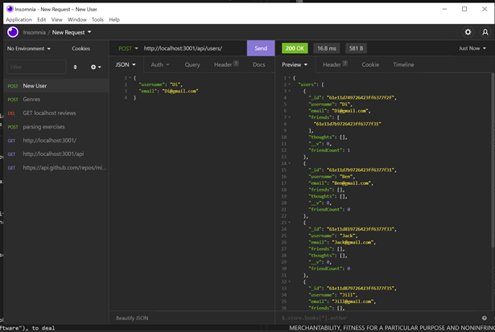
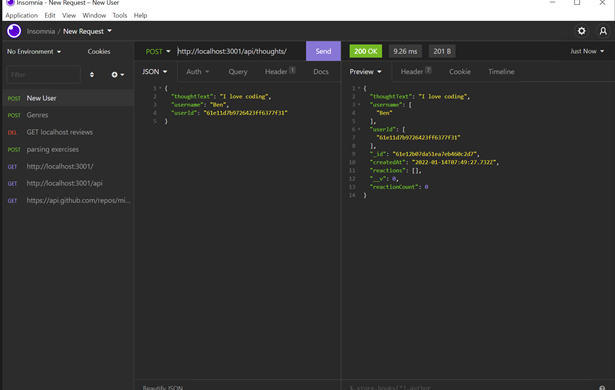
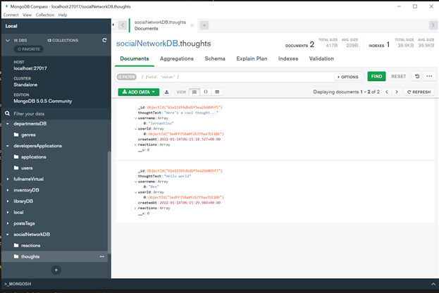

## Social Network API


## Table of Contents
* [GitHub](#GitHub)
* [Description](#description)
* [Installation Instructions](#installation-instructions)
* [Usage Instructions](#usage-instructions)
* [Contribution Guidelines](#contribution-guidelines)
* [Test](#test)
* [Questions](#questions)
* [License](#license)

## GitHub
My GitHub username is B3nj1e. 
Please click [here](https://github.com/B3nj1e) to access my GitHub profile and the associated repository [here](https://github.com/B3nj1e/Social-Network-API).

## Description
A social network API using Express.js, NoSQL database; MongoDB and mongoose. This API allows the someone to get, create, update, and delete a user account. This API also allows the user to share their thoughts and react to friends' thoughts, and create a friend list. 

User story:
```md
AS A social media startup
I WANT an API for my social network that uses a NoSQL database
SO THAT my website can handle large amounts of unstructured data
```
Acceptance Criteria:

```md
GIVEN a social network API
WHEN I enter the command to invoke the application
THEN my server is started and the Mongoose models are synced to the MongoDB database
WHEN I open API GET routes in Insomnia for users and thoughts
THEN the data for each of these routes is displayed in a formatted JSON
WHEN I test API POST, PUT, and DELETE routes in Insomnia
THEN I am able to successfully create, update, and delete users and thoughts in my database
WHEN I test API POST and DELETE routes in Insomnia
THEN I am able to successfully create and delete reactions to thoughts and add and remove friends to a user’s friend list
```


## Installation Instructions
To use the application, please download all associated files off the [GitHub repository](https://github.com/B3nj1e/Social-Network-API). Ensure node.js is installed. In the terminal run ``npm i`` to install the dependencies and packages. Once you have install the packages, run ``node index.js`` to start the server. Ensure you have Insomnia and MongoDBCompass installed. You will be able to use Insomnia to interact with the server to send and receive data to the database using MongoDB Compass. Using MongoDB Compass you will be able to see data in the tables under "socialNetworkDB" and using Insomina installed you will get able to run the GET, PUT, POST and DELETE HTTP requests to interact with stored data. Use localhost at PORT 3001 to access the routes. Use the POST route to enter you own data.  

## Usage Instructions
Please click [here](https://drive.google.com/file/d/1O0Op4oCU_ERdEUqy774EDY2mU3s52Ikt/view) to view a video tutorial on how to use the User and Friends component of this application, and please click [here](https://drive.google.com/file/d/1MriEU7uehTHdnSNrQQlot3xG0-qu3x-p/view) for a demo on the Thoughts and Reactions components. 

## Contribution Guidelines
If you think you can improve this application, please feel free to make contributions. I will review these changes on GitHub prior to merging them to the main branch.

## Test
To quickly test the application, follow the installation instructions above. To seed the database with some default data, navigate back to Insomnia and post your own data in the following format eg. User 
```json
{
  "username": "Ben",
  "email": "ben@gmail.com"
}
```
and thought below 
```json
{
  "thoughtText": "I love coding",
  "username": "Ben",
  "userId": "5edff358a0fcb779aa23df4"
}
```

If you want to create new data use localhost with PORT 3001 in Insomnia, ensure you use POST route, to view use GET, to remove use DELETE and to update use PUT. Navigate to MongoDB Compass, if the seeding was successful you should have an "socialNetworkDB" database with data entries.

Example of creating a user, using Insomnia.




Example of creating a thought, using Insonia.




Example of database using MongoDB Compass.



## Questions
If you have any questions or would like to report an issue with the application, please contact me vie my email at blankemail@email.com(left blank for privacy concerns). Alternative contact me via my [GitHub account](https://github.com/B3nj1e). 

## License
If you require more information concerning the license, please click [here](https://choosealicense.com/licenses/).

---------------------

MIT License

Copyright (c) 2021 B3nj1e

Permission is hereby granted, free of charge, to any person obtaining a copy
of this software and associated documentation files (the "Software"), to deal
in the Software without restriction, including without limitation the rights
to use, copy, modify, merge, publish, distribute, sublicense, and/or sell
copies of the Software, and to permit persons to whom the Software is
furnished to do so, subject to the following conditions:

The above copyright notice and this permission notice shall be included in all
copies or substantial portions of the Software.

THE SOFTWARE IS PROVIDED "AS IS", WITHOUT WARRANTY OF ANY KIND, EXPRESS OR
IMPLIED, INCLUDING BUT NOT LIMITED TO THE WARRANTIES OF MERCHANTABILITY,
FITNESS FOR A PARTICULAR PURPOSE AND NONINFRINGEMENT. IN NO EVENT SHALL THE
AUTHORS OR COPYRIGHT HOLDERS BE LIABLE FOR ANY CLAIM, DAMAGES OR OTHER
LIABILITY, WHETHER IN AN ACTION OF CONTRACT, TORT OR OTHERWISE, ARISING FROM,
OUT OF OR IN CONNECTION WITH THE SOFTWARE OR THE USE OR OTHER DEALINGS IN THE
SOFTWARE.